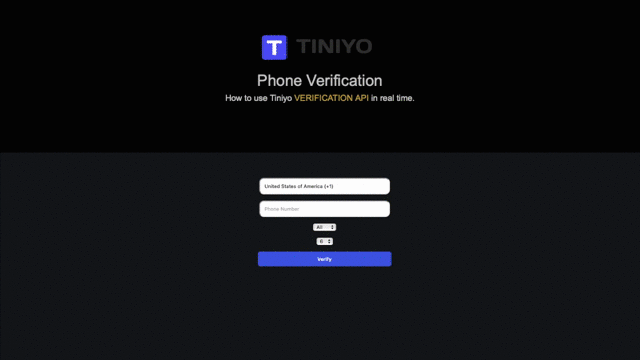

# php-otp-verification
This repository allows, to create a phone number verification using sms/call OTP in PHP.



## Requirements
- PHP 7.3.11
- Create a Free Account at Tiniyo [https://tiniyo.com]

## Setup

- Clone the php-otp-verification into your go path and change directory to cloned repository.

```bash
$ git clone https://github.com/tiniyo-api/php-otp-verification.git
$ cd php-otp-verification
```
- Setting up Virtual Environment

```bash
brew install composer
composer install
```

- Create your Free **TINIYO** Account and grab your **"API Key"**: <https://www.tiniyo.com>

- Copy ```.env.example``` to ```.env``` and update it with your **Tiniyo** credentials.


- Run the Local PHP Web-Server in your console.

```bash
$ php -S 127.0.0.1:8080
```

*Navigate to <http://localhost:8080> to try it out!
